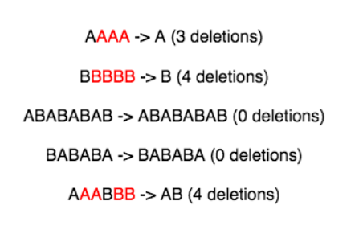

# Alternating Characters

You are given a string containing characters **A** and **B** only. Your task is to change it into a string such that there are no
matching adjacent characters. To do this, you are allowed to delete zero or more characters in the string.

Your task is to find the minimum number of required deletions.

For example, given the string **_s_ = AABAAB**, remove an **A** at positions **0** and  **3** to make **_s_ = ABAB** in **2** deletions.

**Function Description**

Complete the _alternatingCharacters_ function in the editor below. It must return an integer representing the minimum
number of deletions to make the alternating string.
alternatingCharacters has the following parameter(s):
     
 - _s_ : a string

**Input Format**

The first line contains an integer **_q_**, the number of queries.
The next **_q_** lines each contain a string **_s_**.

**Constraints**
- **1 <= _q_ <= 10**
- **1 <= |_s_| <= 10^5**
- Each string **_s_** will consist only of characters **A** and **B**

**Output Format**
For each query, print the minimum number of deletions required on a new line.

**Sample Input**
```
5
AAAA
BBBBB
ABABABAB
BABABA
AAABBB
```
**Sample Output**
```
3
4
0
0
4
```

**Explanation**

The characters marked red are the ones that can be deleted so that the string doesn't have matching consecutive
characters.



