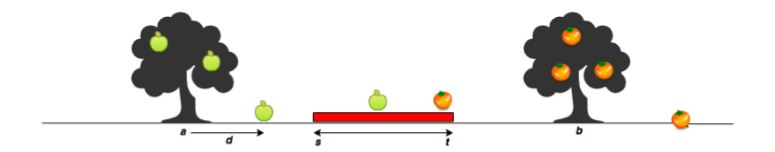

# Apple and Orange

Sam's house has an apple tree and an orange tree that yield an abundance of fruit. In the diagram below,
the red region denotes his house, where **_s_** is the start point, and **_t_** is the endpoint. The apple tree is to the
left of his house, and the orange tree is to its right. You can assume the trees are located on a single
point, where the apple tree is at point **_a_** , and the orange tree is at point **_b_** .


When a fruit falls from its tree, it lands **_d_** units of distance from its tree of origin along the **_x_**-axis. A
negative value of **_d_** means the fruit fell **_d_** units to the tree's left, and a positive value of **_d_** means it falls **_d_**
units to the tree's right.

Complete the function countApplesAndOranges,

where,

 **_start_** Starting point of Sam's house location.
 **_stop_** Ending location of Sam's house location.
 **_loc<sub>_a_</sub>_** Location of the Apple tree.
 **_loc<sub>_o_</sub>_** Location of the Orange tree.
 **_size<sub>_a_</sub>_** Number of apples that fell from the tree.
 **_apples_** Distance at which each apple falls from the tree.
 **_size<sub>_o_</sub>_** Number of oranges that fell from the tree.
 **_oranges_** Distance at which each orange falls from the tree.

Given the value **_d_** of for **_m_** apples and **_n_** oranges, can you determine how many apples and oranges will
fall on Sam's house (i.e., in the inclusive range **[_s,t_]**)? Print the number of apples that fall on Sam's house
as your first line of output, then print the number of oranges that fall on Sam's house as your second line
of output.

**Input Format**
 
The first line contains two space-separated integers denoting the respective values of **_s_** and **_t_**.
The second line contains two space-separated integers denoting the respective values of **_a_** and **_b_**.
The third line contains two space-separated integers denoting the respective values of  **_m_** and **_n_**.
The fourth line contains **_m_** space-separated integers denoting the respective distances that each apple
falls from point **_a_**.
The fifth line contains **_n_**space-separated integers denoting the respective distances that each orange falls
from point **_b_**.

**Constraints**
- **1 <= _s,t,a,b,m,n_ <= 10<sup>5</sup>**
- **-10<sup>5</sup> <= _d_ <= 10 <sup>5<sup>**
-  **_a_ < _s_ < _t_ < _b_**

**Output Format**

Print two lines of output:
- On the first line, print the number of apples that fall on Sam's house.
- On the second line, print the number of oranges that fall on Sam's house.

**Sample Input 0**

```
7 11
5 15
3 2
-2 2 1
5 -6
```
**Sample Output 0**

```
1
1
```
**Explanation 0**

The first apple falls at position **5 - 2 = 3**.
The second apple falls at position **5 + 2 = 7**.
The third apple falls at position **5 + 1 = 6**.
The first orange falls at position **15 + 5 = 20**.
The second orange falls at position **15 - 6 = 9**.
Only one fruit (the second apple) falls within the region between **7** and **11**, so we print **1** as our first line of
output.
Only the second orange falls within the region between **7** and **11**, so we print **1** as our second line of
output.
